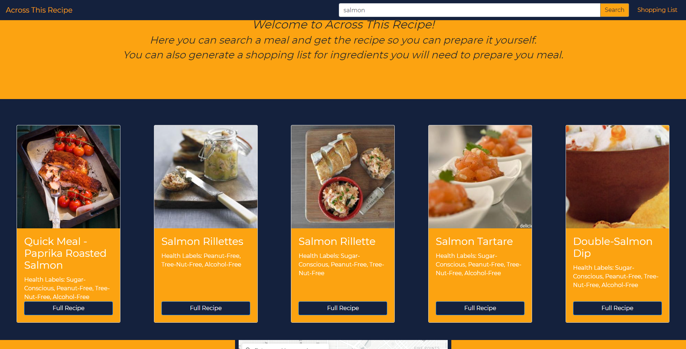
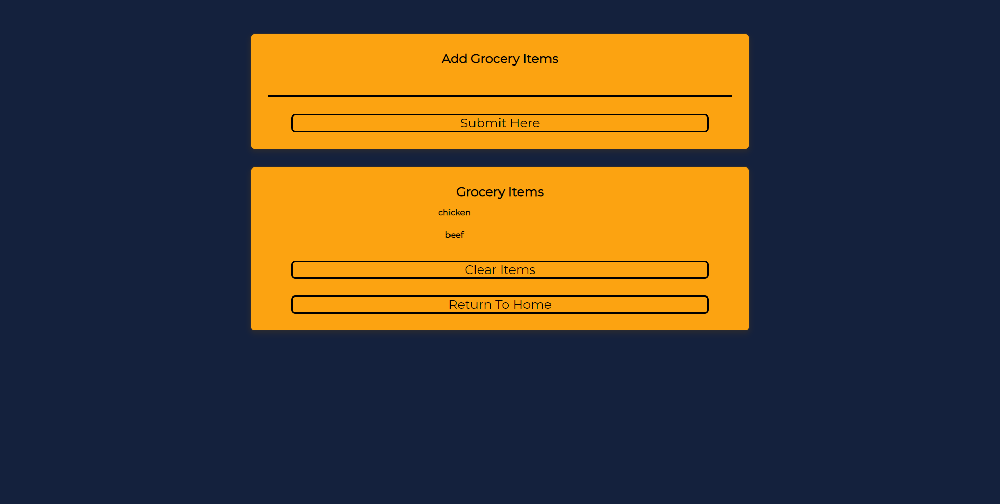

## Across This Recipe <https://loving-hugle-ae78b2.netlify.app> 

This is simple app allows the user to search for different meal ideas and return the ingredients, nutrition info and recipe information. It has a map that uses a bounding box around denver to show various grocery stores and supermarkets. There is also a shopping list where ingredients can be typed in and saved to a list.


**How To Use App**

To use the app simply click on the link provided above. Once on the app enter a food you are interested in making into the search bar then click the search button. 5 meal choices will appear in the blue area in the middle of the page. Click the button for more information and a modal dialog box will appear with ingredients, nutrition info and a link to URL for the recipe. To use the map simply type in your address and grocery stores will populate with markers within a 1 mile radius of your address. To use the shopping list, simply click on the shopping list link in the top right. Type in the item you want to add and press the submit here button and it will add it to the 2nd box. To delete an item press clear items.

**Tech Stack**

- Javascript, HTML, CSS, Boostrap
- API : Edamam, Mapbox

**MVP**

Our base goal was to have a working base that brought up the meal cards and a working map.  We accomplished this.


**Stretch Goals**

Implement a shopping list where you can type in the ingredients you need for your meal and save them to a list.

**Code Snippets**

```
function useApiData(data){
    document.querySelector("#content").innerHTML = "";
    const numberAlreadyGenerated = []
    try {
        for (let i = 0;i < 5; i++) {
            let number = 0;
            let found = 0;
            while (found === number) {
                number = Math.floor(Math.random() * 9);
                found = numberAlreadyGenerated.find(element => element === number)
            }
            numberAlreadyGenerated.push(number)
        
            let recipe = JSON.stringify(data.hits[number].recipe)
            document.querySelector("#content").innerHTML += `
            
                <div class="card" style="width: 18rem;">
                    
                    <div class="card-body cp-bg-gold text-white d-flex flex-column justify-content-between">
                    <div>
                        <h3 class="card-title">${data.hits[number].recipe.label}</h3>
                        <p class="card-text">Health Labels: ${data.hits[number].recipe.healthLabels.join(", ")}</p>
                    </div>
                        <button onClick="renderModal(${JSON.stringify(recipe).split('"').join("&quot;")})" type="button" class="btn btn-primary cp-bg-blue" data-toggle="modal" data-target="#modal">Full Recipe</button>
                    </div>
                </div>
            
                `
        }
    } catch(e) {
        window.alert("You have reached the maximum amount of searches, please refresh the page and start again.")
    }
}
```


```
//////PLACES MARKER AND SHOWS WITHIN 1 MILE DATA FROM TILESET//////
map.addControl(geocoder, 'top-left');
    var marker = new mapboxgl.Marker({'color': '#008000'})
    geocoder.on('result', function(data) {
        var point = data.result.center;
        var tileset = 'examples.dl46ljcs';
        var radius = 1609;
        var limit = 50;
        var query = 'https://api.mapbox.com/v4/' + tileset + '/tilequery/' + point[0] + ',' + point[1] + '.json?radius=' + radius + '&limit= ' + limit + ' &access_token=' + mapboxgl.accessToken;
        marker.setLngLat(point).addTo(map);
        $.ajax({
        method: 'GET',
        url: query,
        }).done(function(data) {
        map.getSource('tilequery').setData(data);
        })
    });
```


```
///SHOPPPING LIST//////
function showAction(element, text, value){
    if (value === true){
        element.classList.add('success');
        element.innerText = text;
        input.value = '';
        setTimeout(function(){
            element.classList.remove('success');
        }, 3000)
    } else {
        element.classList.add('alert');
        element.innerText = text;
        input.value = '';
        setTimeout(function(){
            element.classList.remove('alert');
        }, 3000)
    }
}
```


**Screen Shots**







**Developer Team**

- Cedael White: UX, Shopping List
- Zachary Akers: UX, Mapbox API
- Ian Haddock: UX, Edamam API

